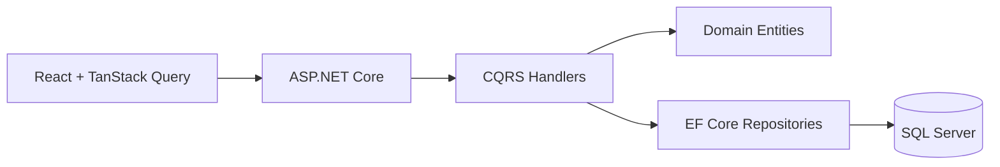

# Project Manager

Simple Task Manager monorepo: ASP.NET Core API (DDD + CQRS), React frontend, SQL Server.

## Monorepo structure

```
ProjectManager/
├── backend/            # C# solution
│   └── src/
│       ├── Domain/         # Entities, value objects, enums
│       ├── Application/    # CQRS (MediatR), DTOs, validation
│       ├── Infrastructure/ # EF Core, repositories, migrations
│       └── Api/            # Minimal API endpoints, OpenAPI
├── frontend/
│   └── web/            # React + Vite + Tailwind + Flowbite
├── schemas/            # Generated OpenAPI (api.json)
└── docker-compose.yml  # SQL Server + Adminer
```

## Prerequisites

- [proto](https://moonrepo.dev/proto) or [moon](https://moonrepo.dev) CLI
- .NET SDK 10+
- Docker

```bash
proto install
```

## Quick start

```bash
# 1. Start SQL Server
docker compose up -d

# 2. Run database migrations
moon run backend:migrate

# 3. Start the API (http://localhost:3100)
moon run api:dev

# 4. In another terminal — generate API client from OpenAPI spec
moon run api:generate-spec
moon run web:generate-dtos

# 5. Start the frontend (http://localhost:3000)
moon run web:dev
```

> **Note:** The frontend dev server proxies `/api` requests to `http://localhost:3100`.

## Moon tasks

| Task | Description |
|------|-------------|
| `backend:build` | Build the .NET solution |
| `backend:test` | Run .NET tests |
| `backend:migrate` | Apply EF Core migrations |
| `api:generate-spec` | Generate OpenAPI spec → `schemas/api.json` |
| `web:dev` | Start Vite dev server (port 3000) |
| `web:build` | Production build |
| `web:lint` | ESLint check |
| `web:types` | TypeScript type check |
| `web:generate-dtos` | Orval → typed TanStack Query hooks + Zod schemas |

## Architecture



- **DDD with CQRS** — commands/queries separated in feature folders
- **Minimal API endpoints** mapped in `Api/Endpoints/`
- **FluentValidation** on all commands; domain errors → ProblemDetails
- **OpenAPI** served via `Microsoft.AspNetCore.OpenApi`, Swagger UI in dev
- **Orval** generates type-safe TanStack Query hooks from the OpenAPI spec
- **Atomic design** on the frontend (`atoms`, `molecules`, `organisms`, `pages`)

## API endpoints

| Method | Path | Description |
|--------|------|-------------|
| GET | `/api/projects` | List all projects |
| POST | `/api/projects` | Create a project |
| GET | `/api/projects/{id}` | Get project by ID |
| PUT | `/api/projects/{id}` | Update project |
| DELETE | `/api/projects/{id}` | Delete project (cascades to tasks) |
| GET | `/api/projects/{projectId}/tasks` | List tasks for a project |
| GET | `/api/tasks?status=` | List tasks filtered by status |
| POST | `/api/tasks` | Create a task |
| GET | `/api/tasks/{id}` | Get task by ID |
| PUT | `/api/tasks/{id}` | Update task |
| PATCH | `/api/tasks/{id}/status` | Change task status |
| DELETE | `/api/tasks/{id}` | Delete task |

## Ports

| Port | Service |
|------|---------|
| 3000 | Frontend (Vite dev server) |
| 3100 | API |
| 1433 | SQL Server |
| 3200 | Adminer (DB UI) |

## Design decisions

- **No custom CSS** — Tailwind utilities + Flowbite React only
- **Repository interfaces in Domain layer** — contract defined innermost
- **OpenAPI first** — spec generated from API, consumed by Orval on the frontend
- **Moon monorepo** patterned after BytesMaestros/menuzi layout

